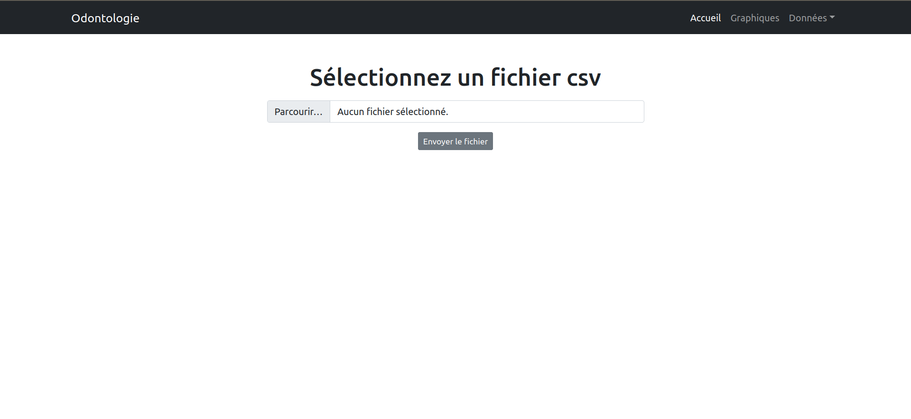
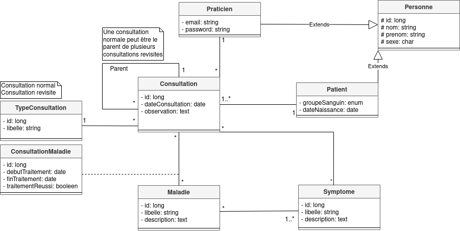
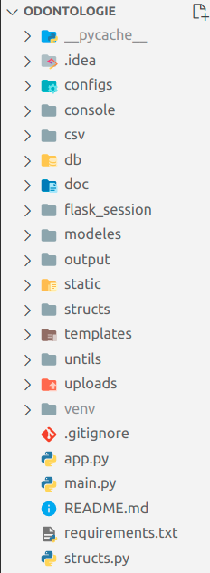

### 1- Description
La branche odontologie de ce dépôt distant est consacrée à la structuration des données du service odontologique. 
L’odontologie est la science médico-chirurgicale couvrant l'étude de l'organe dentaire et des tissus qui lui sont contigus.
Le projet consiste à prendre en entrée un fichier _.csv_ contenant des données et à fournir en sortie un fichier _.json_ formatant
ces données suivant une structure définie par nos soins.


### 2- Installation
Après avoir cloné le projet, vous devez installer les packages dont la liste complète se trouve dans le fichier requirements.txt.
Vous pouvez les installer dans l'espace global ou dans un environnement virturel. Reférez-vous à l'article 
[venv — Création d'environnements virtuels](https://docs.python.org/fr/3/library/venv.html) si vous ignorez comment procéder.
La commande pour l'installation des packages est ```pip install -r ./requirements.txt```. 


### 3- Execution
L'exécution du programme est disponible en deux modes: _le mode web_ et _le mode console_.

#### 3-1- Le mode web
Exécutez la commande ```python3 app.py``` ou ```python app.py``` pour lancer l'interface web. Vous obtiendrez un lien qui, ouvert dans le navigateur
présente l'interface d'accueil permettant d'uploader un fichier csv.

<p align="center">
  
</p>

Parcourez les différennts liens en haut à droite du menu de navigation pour découvrir toutes les options disponibles.

#### 3-2- Le mode console
Bien que non demandé, le mode console fournit une manière interactive supplémentaire d'enrégistrer des informations au sein du fichier de données .json.
Pour éxécuter le programme en mode console, tapez la commande ```python3 main.py``` ou ```python main.py```.
Lorsque vous l'exécutez vous êtes invité à taper votre adresse mail. Si votre adresse mail est connue du système, 
vous entrez votre mot de passe et accédez au menu.
Si votre adresse mail n'est pas connue, vous enrégistrez vos informations personnelles et vos accédez au menu.
Parcourez les différentes options à votre guise.


### 4- Le diagramme des classes
Ci-dessous le diagramme des classes sur lequel nous nous sommes basés pour la réalisation du projet.

<p align="center">
  
</p>

### 5- Structure et description des répertoires du code source du projet
L'image ci-dessous montre la structure des répertoires du projet.

<p align="center">
  
</p>

Ci-dessous les répertoires essentiels et leurs contenus.
* *__modeles__*: contient les différentes entités décrites par le diagramme des classes de la section 4 ;
* *__db__*: contient le fichier intermédiaire *db_cpoo.json*. *db_cpoo.json* est la structure intermédiaire(listes de données avec id) manipulée par notre programme ;
* *__static__*: contient le fichier _cpoo.json_ et les dossiers _css, js, assets_(fichiers utilisés pour l'interface web). 
Le fichier *__cpoo.json__*: est la structure finale de sortie de notre programme ;
* *__uploads__*: contient le fichier ou les fichiers csv envoyer via l'interface web de la page d'accueil ;
* *__configs__*: contient le fichier _base.py_ dans lequel sont configurés les emplacements des différents fichiers de stockages ;
* *__structs__*: contient les programmes pour la lecture et l'écriture des fichiers (csv, json) ;
* *__console__*: contient les programmes pour la console ;
* *__templates__*: contient les fichiers html pour l'interface web.


### 6- Technologies
La liste non exhaustive des technonolgies utilisées pour la réalisation du projet se présente comme suit:
* Python ;
* Flask ;
* Bootstrap 5 ;
* Datatables.js ;
* Jquery.
